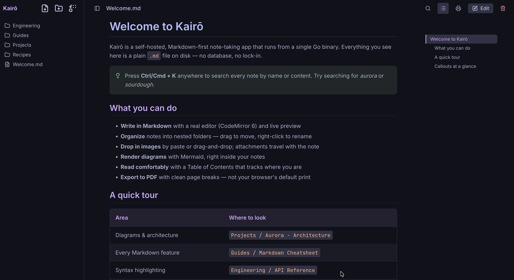
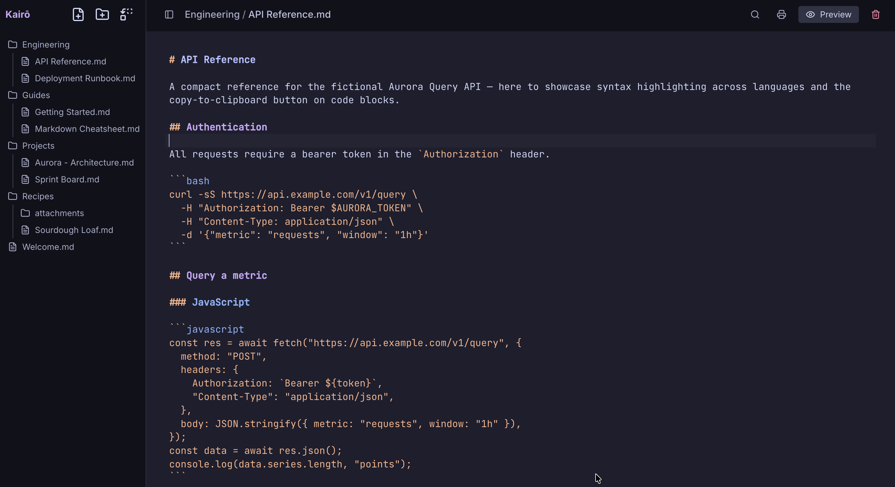
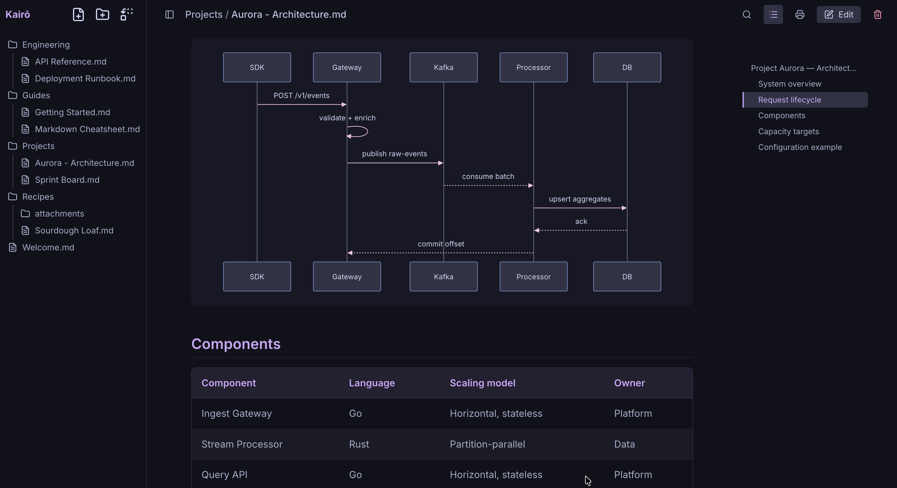
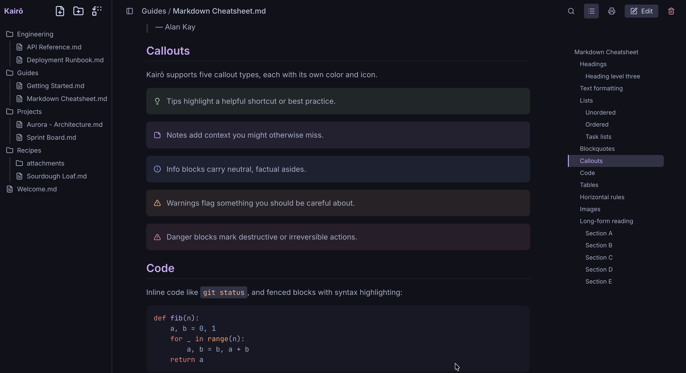
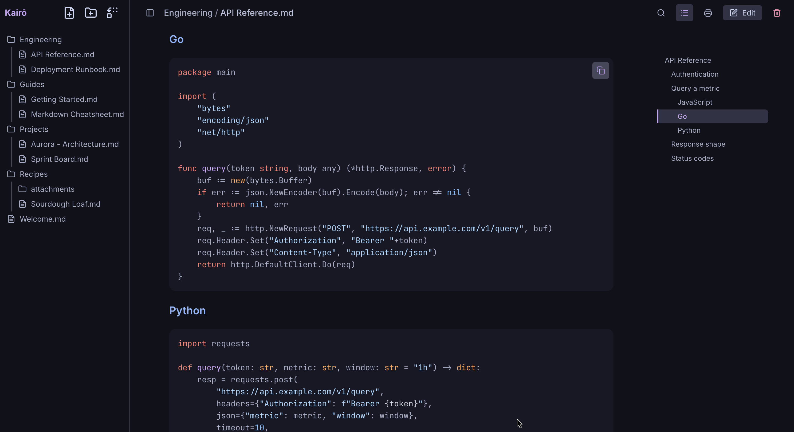
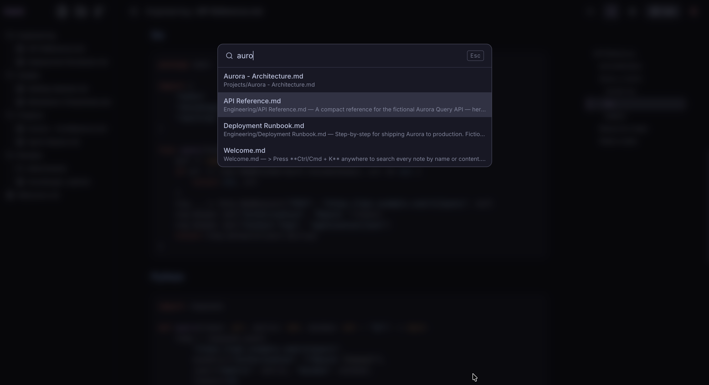

<div align="center">
  
  <h1>Kairō</h1>

  <a href="https://github.com/tanq16/kairo/actions/workflows/release.yaml"></a>&nbsp;<a href="https://hub.docker.com/r/tanq16/kairo"></a><br>
  <a href="https://github.com/tanq16/kairo/releases"></a><br><br>
  <a href="#features">Features</a> &bull; <a href="#screenshots">Screenshots</a> &bull; <a href="#installation-and-usage">Install & Use</a> &bull; <a href="#tips-and-notes">Tips & Notes</a>
</div>

---

A simple note-taking application with Markdown support, built in Go.

## Features

- **Markdown Editing**: Write and edit Markdown notes with syntax highlighting using CodeMirror 6
- **Live Preview**: Toggle between edit and preview modes with real-time rendering (preview by default)
- **Full-Text Search**: Instantly find notes by name or content with a keyboard-driven palette (Ctrl/Cmd+K)
- **Table of Contents**: Auto-generated contents pane that tracks the section you're reading as you scroll
- **File Management**: Create, delete, move, and rename files and folders with automatic attachment handling
- **Image Support**: Paste or drag-and-drop images directly into notes, with inline preview for image files
- **Mermaid Diagrams**: Render Mermaid diagrams in your notes
- **Callout Blocks**: Support for styled callouts (TIP, NOTE, INFO, WARNING, DANGER)
- **Code Highlighting**: Syntax highlighting for code blocks with copy-to-clipboard functionality
- **PDF Export**: Print or export notes as clean, paginated PDFs (not the browser's default), with styled or plain black-and-white output and adjustable scale
- **Light & Dark Themes**: Catppuccin Latte (light) and Mocha (dark), toggled from the toolbar and remembered between visits
- **Lucide Icons**: Modern icon set throughout the interface
- **Responsive Design**: Works on both desktop and mobile devices, with a resizable sidebar on desktop
- **Self-Contained**: Single Go binary with embedded frontend assets

## Screenshots

<details>
<summary>Click to expand screenshots</summary>


*The main interface — file tree, rendered Markdown, and the live Table of Contents*


*CodeMirror 6 editor with Markdown syntax highlighting*


*Mermaid diagrams render inline, themed to match*


*Styled callout blocks: tip, note, info, warning, and danger*


*Syntax-highlighted code blocks with one-click copy*


*Full-text search across every note (Ctrl/Cmd+K)*

</details>

## Installation and Usage

### Docker

```bash
docker run -d -p 8080:8080 -v /path/to/notes:/data tanq16/kairo:latest
```

### Binary

Download from [releases](https://github.com/tanq16/kairo/releases) and run:

```bash
./kairo --port 8080
```

### Build from Source

```bash
git clone https://github.com/tanq16/kairo
cd kairo
make build
./kairo
```

### Command Options

- `--port, -p`: Port to listen on (default: 8080)
- `--host, -H`: Host to bind to (default: 0.0.0.0)
- `--data, -d`: Path to the data directory (default: ./data)

Once the server is running, open your browser and navigate to the displayed URL (e.g., `http://localhost:8080`).

## Tips and Notes

- The default data directory is `./data` - all your notes will be stored there
- You can specify a custom data directory with the `--data` flag
- The application supports nested folders - create folders by ending the name with `/` when creating new items
- Paste or drag-and-drop images into the editor to attach them to your notes
- Moving a note also moves its attachments and updates all image references automatically
- Mermaid diagrams are rendered automatically when you use ` ```mermaid ` code blocks
- Callout blocks use the format: `> [!TIP]` or `> [!NOTE]` etc.
- Files are auto-saved as you type - look for the save indicator in the toolbar
- Press `Ctrl/Cmd+K` to search all notes by name or content; `Esc` closes the search
- Toggle the Table of Contents with the list icon in the toolbar - the active section follows your scroll position
- The sidebar can be toggled on desktop and mobile, and resized by dragging its right edge on desktop
- Switch between light (Latte) and dark (Mocha) themes with the theme toggle in the toolbar - the app opens in dark mode and remembers your choice
- Use the printer icon in the toolbar to export a PDF - pick **Styled** or **Plain** (black & white) output at 100% or a custom scale, without browser headers or footers
