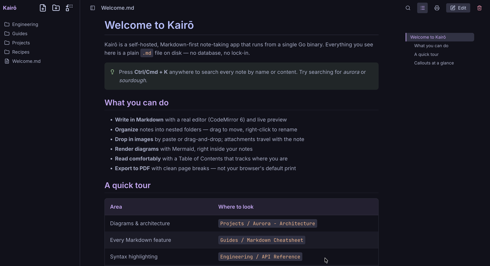
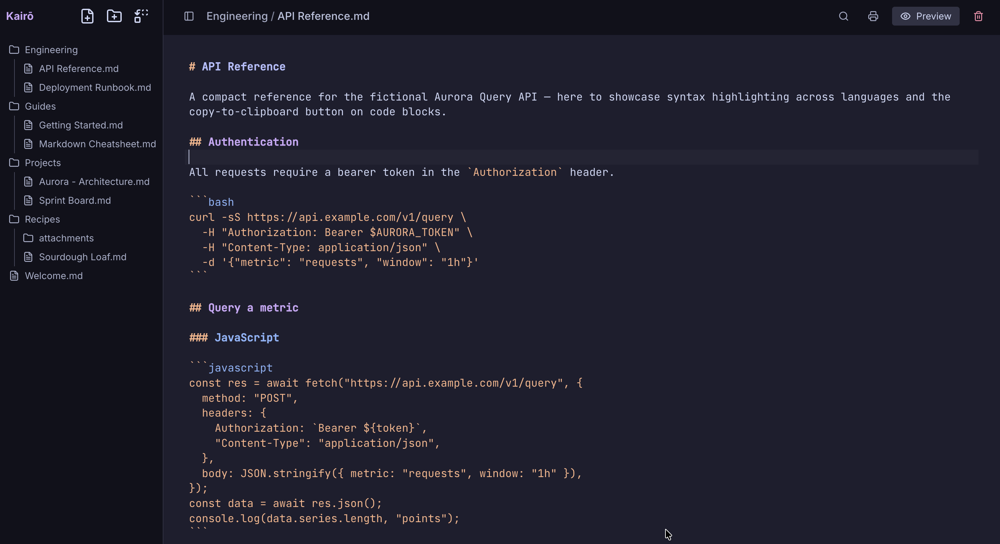
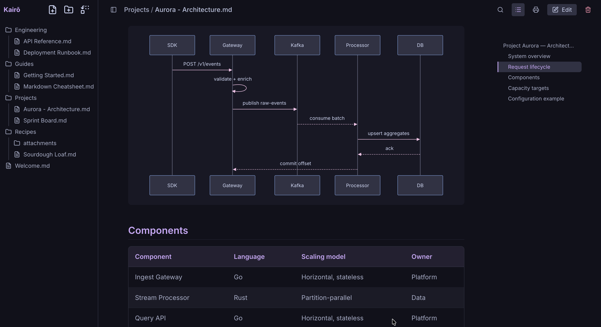
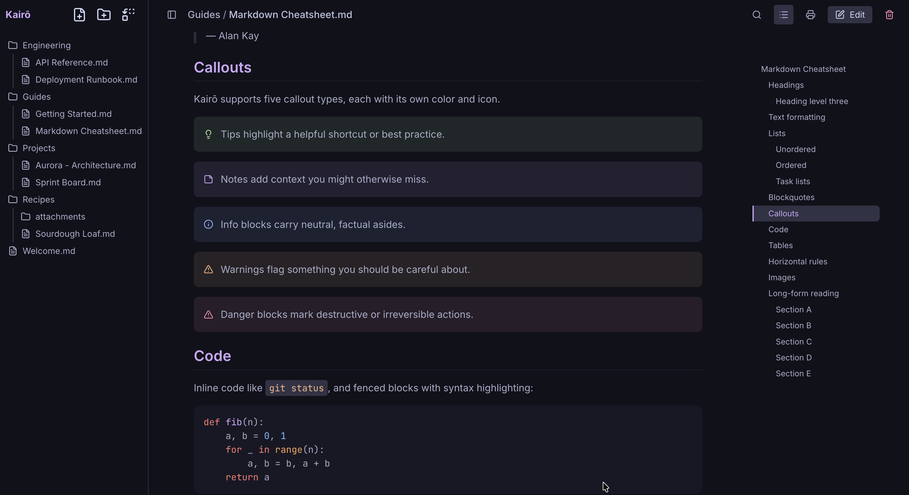
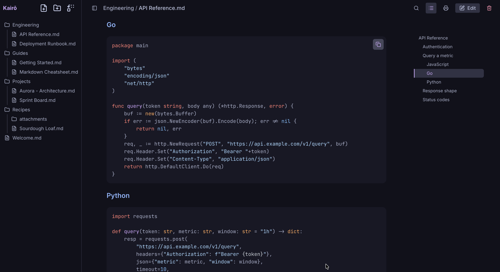
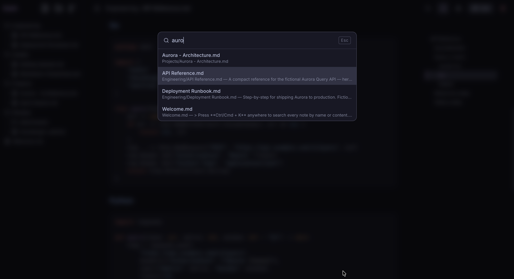

<div align="center">
  
  <h1>Kairō</h1>

  <a href="https://github.com/tanq16/kairo/actions/workflows/release.yaml"></a>&nbsp;<a href="https://hub.docker.com/r/tanq16/kairo"></a><br>
  <a href="https://github.com/tanq16/kairo/releases"></a><br><br>
  <a href="#features">Features</a> &bull; <a href="#screenshots">Screenshots</a> &bull; <a href="#install">Install</a> &bull; <a href="#usage">Usage</a> &bull; <a href="#notes">Notes</a>
</div>

---

A simple note-taking application with Markdown support, built in Go.

## Features

- **Markdown Editing**: Write and edit Markdown notes with syntax highlighting using CodeMirror 6
- **Live Preview**: Toggle between edit and preview modes with real-time rendering (preview by default)
- **Full-Text Search**: Instantly find notes by name or content with a keyboard-driven palette (Ctrl/Cmd+K)
- **Table of Contents**: Auto-generated contents pane that tracks the section you're reading as you scroll
- **File Management**: Create, delete, move, and rename files and folders with automatic attachment handling
- **Image Support**: Paste or drag-and-drop images directly into notes, with inline preview for image files
- **Mermaid Diagrams**: Render Mermaid diagrams in your notes
- **Callout Blocks**: Support for styled callouts (TIP, NOTE, INFO, WARNING, DANGER)
- **Code Highlighting**: Syntax highlighting for code blocks with copy-to-clipboard functionality
- **PDF Export**: Print or export notes as clean, paginated PDFs (not the browser's default), with styled or plain black-and-white output and adjustable scale
- **Light & Dark Themes**: Catppuccin Latte (light) and Mocha (dark), toggled from the toolbar and remembered between visits
- **Lucide Icons**: Modern icon set throughout the interface
- **Responsive Design**: Works on both desktop and mobile devices, with a resizable sidebar on desktop
- **Self-Contained**: Single Go binary with embedded frontend assets

## Screenshots

<details>
<summary>Click to expand screenshots</summary>


*The main interface - file tree, rendered Markdown, and the live Table of Contents*


*CodeMirror 6 editor with Markdown syntax highlighting*


*Mermaid diagrams render inline, themed to match*


*Styled callout blocks: tip, note, info, warning, and danger*


*Syntax-highlighted code blocks with one-click copy*


*Full-text search across every note (Ctrl/Cmd+K)*

</details>

## Install

### Docker

The container runs as non-root user `10001:10001`. Ensure the mounted host directory is owned or writable by UID 10001:

```bash
mkdir -p $HOME/.kairo
```

```bash
docker run -d --name kairo \
  -p 8080:8080 \
  -v $HOME/.kairo:/data \
  tanq16/kairo:latest
```

Available at `http://localhost:8080`. The same setup as a compose file:

```yaml
services:
  kairo:
    image: tanq16/kairo:latest
    container_name: kairo
    restart: unless-stopped
    ports:
      - "8080:8080"
    volumes:
      - ./data:/data
```

### Binary

Download from [releases](https://github.com/tanq16/kairo/releases) and run:

```bash
./kairo --port 8080
```

### Build from Source

Requires Go 1.27+.

```bash
git clone https://github.com/tanq16/kairo
cd kairo
make build
./kairo
```

## Usage

### Command Options

```bash
./kairo [flags]
```

- `--port, -p`: Port to listen on (default: 8080)
- `--host, -H`: Host to bind to (default: 0.0.0.0)
- `--data, -d`: Path to the data directory (default: ./data)
- `--debug`: Enable debug logging

Once the server is running, open your browser and navigate to `http://localhost:8080`.

## Notes

- **Data directory**: Stored at `./data` by default; custom path can be specified with `--data`.
- **Nested folders**: Create folders by ending the name with `/` when creating new items.
- **Attachments**: Paste or drag-and-drop images into the editor; moving a note relocates its attachments and updates markdown links automatically.
- **Diagrams**: Mermaid diagrams render automatically inside ` ```mermaid ` code blocks.
- **Callouts**: Styled blocks use the format `> [!TIP]`, `> [!NOTE]`, `> [!WARNING]`, etc.
- **Autosave**: Files are auto-saved as you type, indicated by the toolbar state.
- **Search**: Press `Ctrl/Cmd+K` to search notes by name or content; `Esc` closes the palette.
- **Table of Contents**: Toggle the list icon in the toolbar; active section highlights dynamically on scroll.
- **Themes**: Switch between light (Latte) and dark (Mocha) themes via the toolbar toggle; preference persists in localStorage.
- **PDF Export**: Print or export notes via the toolbar icon with Styled or Plain options and custom scale.
